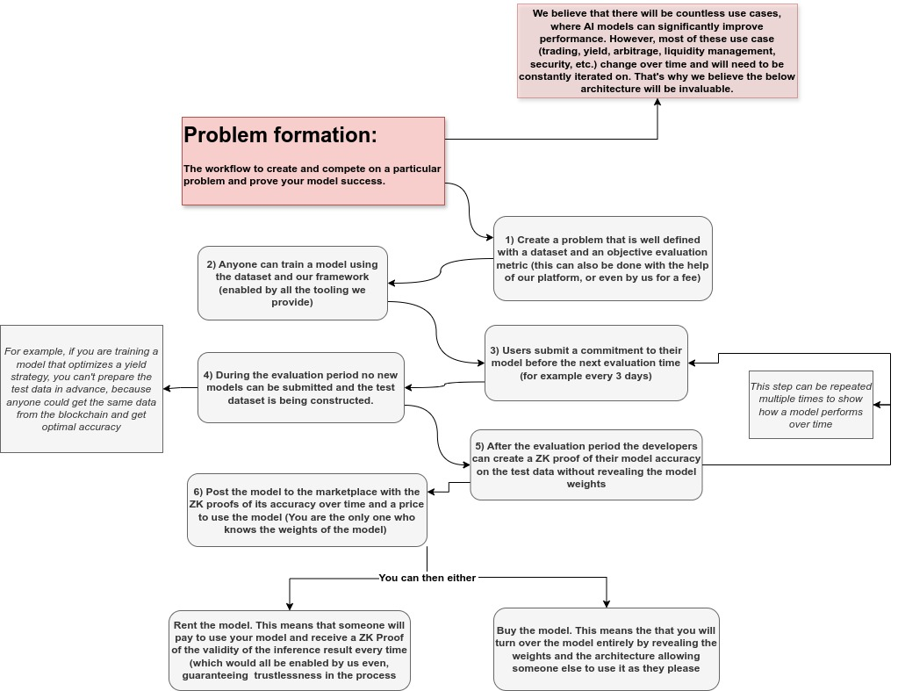

# Octagon AI

Octagon AI is pioneering the first AI marketplace of trust, where developers can prove the accuracy of their models without revealing the model weights, thereby retaining full ownership while still profiting from their work. Our platform leverages sophisticated cryptographic techniques to guarantee the integrity of model training and performance and enabling easy and secure model deployment for both on-chain and off-chain use cases.

## Motivation

Web3 has numerous challenges that can be significantly improved by AI, much like how AI enhances various aspects of Web2. Issues such as trading, liquidity provisioning, and lend/borrow optimizations can be handled far more efficiently with AI compared to hardcoded strategies, as well as being a lot more adaptable ([Link to post about more use cases](#)). The growing number of AI developers and infrastructure projects supporting AI agent creation shows a clear demand for these solutions.

## Problem Statement

One of the biggest obstacles to the adoption of AI solutions is the lack of trust in these models. For instance, Large Language Models (LLMs) are known to hallucinate and provide biased answers. In the crypto space especially, users demand full transparency and verifiability in models, which are often black boxes. If people are to trust their funds or important business use cases to an AI model, they need assurance of its security and functionality. In a future with thousands of AI agents performing various tasks, a marketplace of trust will be crucial for meaningful adoption. Similar to how smart contract audits are essential today, having your AI agent tested will be a critical step for deployment.

## Technical Problems to Solve

Some of the challenging technical problems we aim to solve include:

- **Model Update Validation**: Allowing developers to update their models while proving their continued validity.
- **Seamless Deployment**: Simplifying the deployment process of models in production, including contracts and other infrastructure.
- **Optimal Speed and Security**: Combining Trusted Execution Environments (TEEs) and Zero-Knowledge (ZK) proofs with random sampling.
- **Strategy Privacy**: Concealing individual strategies by batching them with other strategies.
- **Reputation Tracking**: Maintaining a rollup that tracks all model reputations, which is queryable from any chain.
- **Input Privacy**: (Extra difficult) Ensuring model inputs remain private while guaranteeing consistency.

## Perpetual Competitions

We recognize that AI models have the potential to significantly enhance various use cases, such as trading, yield optimization, arbitrage, liquidity management, security, or even supply chain and physical infrastructure optimization. However, these applications are dynamic and evolve over time, necessitating continuous iteration and improvement of the models.

To address this, we have introduced the concept of "Perpetual Competitions." This approach allows anyone to train a model and continuously refine it, demonstrating its success over time. Participants can profit from the model's performance without revealing the model's weights, thereby retaining full ownership and custody of their proprietary models. This framework fosters ongoing innovation and improvement, ensuring that AI models remain effective and up-to-date in an ever-changing landscape.

This not only incentivizes competition and allows developers to be fairly rewarded for their work, but also enables more complex use cases. Problems can be measured on multiple different metrics, allowing users to choose models based on their preferred price and desired properties. By renting these models, users can efficiently test different options to find the one that best fits their specific use case or even combine different models for added redundancy. The main benefit is the ability to avoid committing to a specific model that may become deprecated, instead actively selecting the model that works best at any given time. Additionally, users can specify an intent, and the platform will aggregate and select the model based on their preferences and price requirements.

## Our Team

Our founding team has over four years of joint experience, with diverse expertise in building and deploying blockchain products, developing AI projects, and conducting blockchain data analytics. We have strong connections with AI research institutions and a leading software development firm specializing in crypto and AI. This unique combination of experience, expertise, and strategic partnerships positions us to solve these challenges more effectively than any other team.

## Get Involved

We invite AI developers, blockchain enthusiasts, and organizations to join us in revolutionizing the AI and crypto space. Contribute to our projects, participate in hackathons, and help drive innovation at the intersection of these transformative technologies.

## Contact Us

For more information or to get involved, please reach out to us at [snxjj25@proton.me](snxjj25@proton.me) or visit our [website]().

## Conclusion

Octagon AI is set to revolutionize the integration of AI in the web3 space by building a trustworthy marketplace. Join us in this endeavor to create a more transparent, secure, and efficient future with AI.
